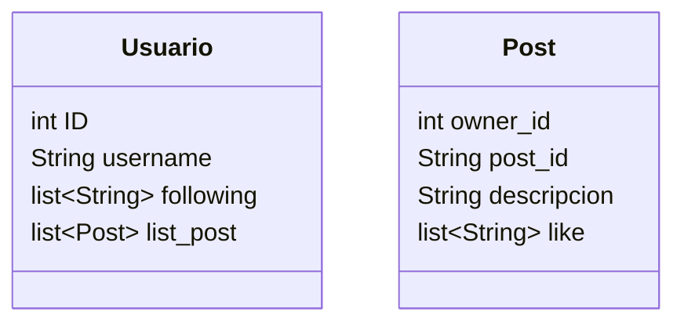

```mermaid
classDiagram
    class Usuario {
        int ID
        String username
        list~String~ following
        list~Post~ list_post
    }

    class Post {
        int owner_id
        String post_id
        String descripcion
        list~String~ like
    }
```
